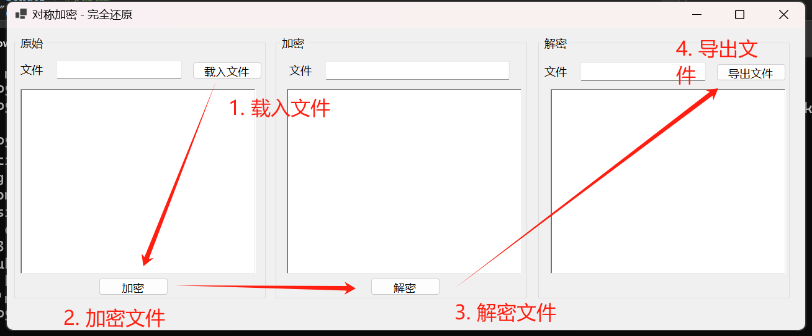
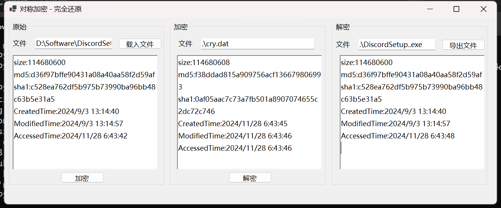

# CryptographicRestore

> 本项目提供一个易用的 AES 加密库，用于安全地加密和解密文件，同时支持元数据保存与恢复以及文件完整性校验功能。该库使用 C# 实现，支持文件加密、解密、元数据操作及哈希值校验。

#### 操作流程

#### 操作截图

## 功能

1. **文件加密**
   - 使用 AES 加密算法加密文件。
   - 保存文件的元数据（创建时间、修改时间、访问时间）。
2. **文件解密**
   - 解密加密文件。
   - 恢复原始文件的元数据。
3. **文件元数据检索**
   - 获取文件的创建时间、修改时间和访问时间等元数据。
4. **文件完整性校验**
   - 通过 MD5 或 SHA1 哈希值比较验证文件是否完整一致。
5. **文件大小计算**
   - 获取文件的大小（以字节为单位）。

